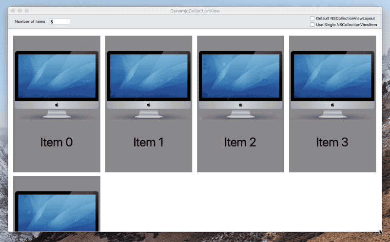
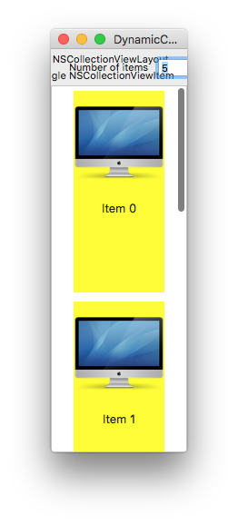
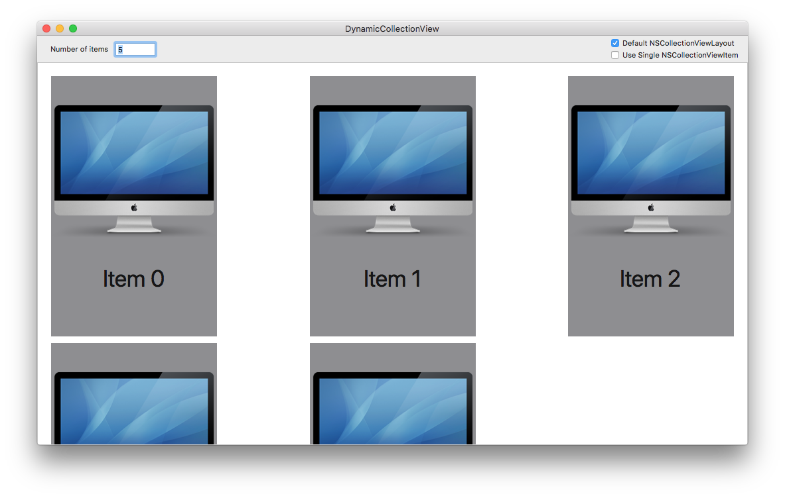
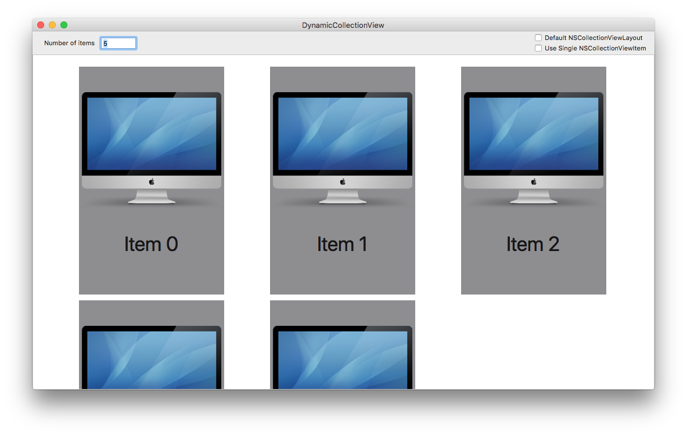

# CenteringCollectionViewFlowLayout
## Introduction

This is a project that demonstrates the use of the "modern" (10.11+) `NSCollectionView` on macOS with the following features:

* A custom subclass of `NSCollectionViewFlowLayout` that centers the collection items in the view.
* Displays a "mini" version of the item when the view is resized narrower than the size of the item.

## Dynamic Sizing of Collection View Items

This demo application displays a user-selected number of items in a standard `NSCollectionView`. When the view bounds become too narrow to display a single item, the view is reloaded and an alternate (mini) representation of the item is displayed. This is useful when view items are relatively large, but provides the option to show a smaller version with less information.

Another advantage is the same exact view can be reused in multiple ways. For example, one could create a very narrow view and use the collection as half of a master/detail interface:

## Centering Flow Layout

The default `NSCollectionViewFlowLayout` displays items from left to right, top to bottom. This looks great when the items are relatively small compared to the main view (e.g. see the Apple sample code application [CocoaSlideCollection](https://developer.apple.com/library/archive/samplecode/CocoaSlideCollection/Introduction/Intro.html)), but when each item is large it leads to layouts like this:

When a row is "full", the items are pinned to the left and right and the spacing in between jumps around. The enclosed layout class [CenteredFlowLayout.m](DynamicCollectionView/DynamicCollectionView/Collection\ View\ Classes/CenteredFlowLayout.m) centers the items by taking the available whitespace – between the frame and the items plus the interitem spacing – and divides it evenly:

The layout respects the [`sectionInset`](https://developer.apple.com/documentation/appkit/nscollectionviewflowlayout/1402862-sectioninset) and [`minimumInteritemSpacing`](https://developer.apple.com/documentation/appkit/nscollectionviewflowlayout/1402872-minimuminteritemspacing) properties of the layout. The class can be dropped into any project and has no external dependencies. (Maybe even on iOS? I haven't tried it.)

## Demonstration Options

The application has a few buttons to press.

##### "Default NSCollectionViewFlowLayout"

Tick this box to toggle between the default `NSCollectionViewFlowLayout` and the `CenteredFlowLayout` to see the differences between them.

##### "Use Single NSCollectionViewItem"

The dynamic sizing between the large and small item can be implemented in at least two ways, and this application demonstrates both. 

 * Use two independent subclasses of `NSCollectionViewItem` and have the code return one or the other.
 * Define both views in a single `NSCollectionViewItem`, and swap the views as needed.
 
 There are advantages to each approach.

##### "Number of items"

The number of items in the collection view can be updated by entering a new number in the text field.
